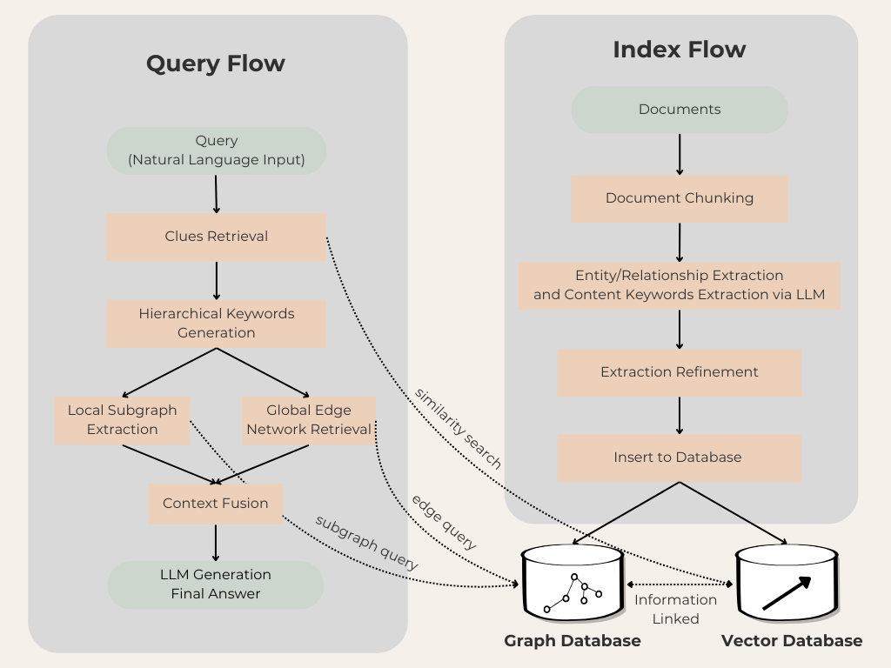

<center><h2>📚 AcademicRAG: More Efficient and Reliable Graph based RAG for Academic and General Texts Search</h2></center>
<div align="center">


This repository hosts the code of AcademicRAG. The structure of this code is based on <a href="https://github.com/HKUDS/LightRAG">LightRAG</a>.



The Algorithm Flowchart of AcademicRAG

</div>


## Install 

### Install AcademicRAG Core
* Install from source

```bash
cd academicRAG
pip install -e .
```

<details>
  <summary><b>common problem</b></summary>

Error 1:
```bash
ModuleNotFoundError: No module named 'tqdm'
```

Solution:
```bash
pip install tqdm
```

Error 2:
```bash
ModuleNotFoundError: No module named 'past'
```

Solution:
```bash
pip install future
```
</details>

### Install AcademicRAG Core & Server
The AcademicRAG Server is designed to provide Web UI and API support. 
The Web UI facilitates document indexing, knowledge graph exploration, and a simple RAG query interface. 
It also provides an Ollama compatible interfaces, aiming to emulate AcademicRAG as an Ollama chat model. This allows AI chat bot, such as Open WebUI, to access AcademicRAG framework easily.

```bash
cd academicRAG
pip install -e ".[api]"
```


## Quick Start
* All the code can be found in the `examples`.
* You can try `examples/academicrag_openai_quick_start.py` for a simple and fast start.
* Before using `examples/academicrag_openai_quick_start.py`, you need to set OpenAI API key in environment (E.g. `export OPENAI_API_KEY="sk-...".`). 
* Download the demo text "A Christmas Carol by Charles Dickens":
```bash
curl https://raw.githubusercontent.com/gusye1234/nano-graphrag/main/tests/mock_data.txt > ./book.txt
``` 
* You can also try other tiny text file in `examples/data` for a quick start.

##AcademicRAG Function
### Query

Use the below Python snippet (in a script) to initialize AcademicRAG and perform queries:

```python
import os
import asyncio
from academicrag import AcademicRAG, QueryParam
from academicrag.llm.openai import gpt_4o_mini_complete, gpt_4o_complete, openai_embed
from academicrag.utils import setup_logger
from academicrag.kg.shared_storage import initialize_pipeline_status

setup_logger("academicrag", level="INFO")

async def initialize_rag():
    rag = AcademicRAG(
        working_dir="your/path",
        embedding_func=openai_embed,
        llm_model_func=gpt_4o_mini_complete
    )

    await rag.initialize_storages()
    await initialize_pipeline_status()

    return rag

rag = asyncio.run(initialize_rag())

# Insert text
rag.insert("Your text")

# Perform naive rag search
mode="naive"
# Perform subgraph(local) search
mode="subgraph"
# Perform global search
mode="global"
# Perform hybrid(subgraph+global) search
mode="hybrid"
# Mix mode Integrates knowledge graph and vector retrieval(naive+hybrid).
mode="mix"

rag.query(
    "What are the top themes in this story?",
    param=QueryParam(mode=mode)
)
```

#### Query Param

```python
class QueryParam:
    mode: Literal["subgraph", "global", "hybrid", "naive", "mix"] = "global"
    """Specifies the retrieval mode:
    - "subgraph": Focuses on context-dependent information.
    - "global": Utilizes global knowledge.
    - "hybrid": Combines subgraph and global retrieval methods.
    - "naive": Performs a basic search without advanced techniques.
    - "mix": Integrates knowledge graph and vector retrieval. Mix mode combines knowledge graph and vector search:
        - Uses both structured (KG) and unstructured (vector) information
        - Provides comprehensive answers by analyzing relationships and context
        - Supports image content through HTML img tags
        - Allows control over retrieval depth via top_k parameter
    """
    only_need_context: bool = False
    """If True, only returns the retrieved context without generating a response."""
    response_type: str = "Multiple Paragraphs"
    """Defines the response format. Examples: 'Multiple Paragraphs', 'Single Paragraph', 'Bullet Points'."""
    top_k: int = 60
    """Number of top items to retrieve. Represents entities in 'subgraph' mode and relationships in 'global' mode."""
    max_token_for_text_unit: int = 4000
    """Maximum number of tokens allowed for each retrieved text chunk."""
    max_token_for_global_context: int = 4000
    """Maximum number of tokens allocated for relationship descriptions in global retrieval."""
    max_token_for_subgraph_context: int = 4000
    """Maximum number of tokens allocated for entity descriptions in subgraph retrieval."""
    ...
```

> default value of Top_k can be change by environment  variables  TOP_K.

<details>
<summary> <b>Using Open AI-like APIs</b> </summary>

* AcademicRAG also supports Open AI-like chat/embeddings APIs:
```python
async def llm_model_func(
    prompt, system_prompt=None, history_messages=[], keyword_extraction=False, **kwargs
) -> str:
    return await openai_complete_if_cache(
        "solar-mini",
        prompt,
        system_prompt=system_prompt,
        history_messages=history_messages,
        api_key=os.getenv("UPSTAGE_API_KEY"),
        base_url="https://api.upstage.ai/v1/solar",
        **kwargs
    )

async def embedding_func(texts: list[str]) -> np.ndarray:
    return await openai_embed(
        texts,
        model="solar-embedding-1-large-query",
        api_key=os.getenv("UPSTAGE_API_KEY"),
        base_url="https://api.upstage.ai/v1/solar"
    )

async def initialize_rag():
    rag = AcademicRAG(
        working_dir="your/path",
        embedding_func=EmbeddingFunc(
            embedding_dim=4096,
            max_token_size=8192,
            func=embedding_func
        ),
        llm_model_func=llm_model_func,
    )

    await rag.initialize_storages()
    await initialize_pipeline_status()

    return rag

```
</details>

<details>
<summary> <b>Using Hugging Face Models</b> </summary>

* If you want to use Hugging Face models, you only need to set AcademicRAG as follows:

See `AcademicRAG_hf_demo.py`

```python
from academicrag.llm import hf_model_complete, hf_embed
from transformers import AutoModel, AutoTokenizer
from academicrag.utils import EmbeddingFunc

# Initialize AcademicRAG with Hugging Face model
rag = AcademicRAG(
    working_dir=WORKING_DIR,
    llm_model_func=hf_model_complete,  # Use Hugging Face model for text generation
    llm_model_name='meta-llama/Llama-3.1-8B-Instruct',  # Model name from Hugging Face
    # Use Hugging Face embedding function
    embedding_func=EmbeddingFunc(
        embedding_dim=384,
        max_token_size=5000,
        func=lambda texts: hf_embed(
            texts,
            tokenizer=AutoTokenizer.from_pretrained("sentence-transformers/all-MiniLM-L6-v2"),
            embed_model=AutoModel.from_pretrained("sentence-transformers/all-MiniLM-L6-v2")
        )
    ),
)
```
</details>

<details>
<summary> <b>Using Ollama Models</b> </summary>

### Overview
If you want to use Ollama models, you need to pull model you plan to use and embedding model, for example `nomic-embed-text`.

Then you only need to set AcademicRAG as follows:

```python
from academicrag.llm.ollama import ollama_model_complete, ollama_embed
from academicrag.utils import EmbeddingFunc

# Initialize AcademicRAG with Ollama model
rag = AcademicRAG(
    working_dir=WORKING_DIR,
    llm_model_func=ollama_model_complete,  # Use Ollama model for text generation
    llm_model_name='your_model_name', # Your model name
    # Use Ollama embedding function
    embedding_func=EmbeddingFunc(
        embedding_dim=768,
        max_token_size=8192,
        func=lambda texts: ollama_embed(
            texts,
            embed_model="nomic-embed-text"
        )
    ),
)
```

### Increasing context size
In order for AcademicRAG to work context should be at least 32k tokens. By default Ollama models have context size of 8k. You can achieve this using one of two ways:

#### Increasing the `num_ctx` parameter in Modelfile.

1. Pull the model:
```bash
ollama pull qwen2
```

2. Display the model file:
```bash
ollama show --modelfile qwen2 > Modelfile
```

3. Edit the Modelfile by adding the following line:
```bash
PARAMETER num_ctx 32768
```

4. Create the modified model:
```bash
ollama create -f Modelfile qwen2m
```

#### Setup `num_ctx` via Ollama API.
Tiy can use `llm_model_kwargs` param to configure ollama:

```python
rag = AcademicRAG(
    working_dir=WORKING_DIR,
    llm_model_func=ollama_model_complete,  # Use Ollama model for text generation
    llm_model_name='your_model_name', # Your model name
    llm_model_kwargs={"options": {"num_ctx": 32768}},
    # Use Ollama embedding function
    embedding_func=EmbeddingFunc(
        embedding_dim=768,
        max_token_size=8192,
        func=lambda texts: ollama_embedding(
            texts,
            embed_model="nomic-embed-text"
        )
    ),
)
```
#### Low RAM GPUs

In order to run this experiment on low RAM GPU you should select small model and tune context window (increasing context increase memory consumption). For example, running this ollama example on repurposed mining GPU with 6Gb of RAM required to set context size to 26k while using `gemma2:2b`. It was able to find 197 entities and 19 relations on `book.txt`.

</details>
<details>
<summary> <b>LlamaIndex</b> </summary>

AcademicRAG supports integration with LlamaIndex.

1. **LlamaIndex** (`llm/llama_index_impl.py`):
   - Integrates with OpenAI and other providers through LlamaIndex
   - See [LlamaIndex Documentation](AcademicRAG/llm/Readme.md) for detailed setup and examples

### Example Usage

```python
# Using LlamaIndex with direct OpenAI access
from academicrag import AcademicRAG
from academicrag.llm.llama_index_impl import llama_index_complete_if_cache, llama_index_embed
from llama_index.embeddings.openai import OpenAIEmbedding
from llama_index.llms.openai import OpenAI

rag = AcademicRAG(
    working_dir="your/path",
    llm_model_func=llama_index_complete_if_cache,  # LlamaIndex-compatible completion function
    embedding_func=EmbeddingFunc(    # LlamaIndex-compatible embedding function
        embedding_dim=1536,
        max_token_size=8192,
        func=lambda texts: llama_index_embed(texts, embed_model=embed_model)
    ),
)
```

#### For detailed documentation and examples, see:
- [LlamaIndex Documentation](AcademicRAG/llm/Readme.md)
- [Direct OpenAI Example](examples/AcademicRAG_llamaindex_direct_demo.py)
- [LiteLLM Proxy Example](examples/AcademicRAG_llamaindex_litellm_demo.py)

</details>
<details>
<summary> <b>Conversation History Support</b> </summary>

AcademicRAG now supports multi-turn dialogue through the conversation history feature. Here's how to use it:

```python
from academicrag import AcademicRAG, QueryParam

# Initialize AcademicRAG
rag = AcademicRAG(working_dir=WORKING_DIR)

# Create conversation history
conversation_history = [
    {"role": "user", "content": "What is the main character's attitude towards Christmas?"},
    {"role": "assistant", "content": "At the beginning of the story, Ebenezer Scrooge has a very negative attitude towards Christmas..."},
    {"role": "user", "content": "How does his attitude change?"}
]

# Create query parameters with conversation history
query_param = QueryParam(
    mode="mix",  # or any other mode: "subgraph", "global", "hybrid"
    conversation_history=conversation_history,  # Add the conversation history
    history_turns=3  # Number of recent conversation turns to consider
)

# Make a query that takes into account the conversation history
response = rag.query(
    "What causes this change in his character?",
    param=query_param
)
```

</details>

<details>
<summary> <b>Custom Prompt Support</b> </summary>

AcademicRAG now supports custom prompts for fine-tuned control over the system's behavior. Here's how to use it:

```python
from academicrag import AcademicRAG, QueryParam

# Initialize AcademicRAG
rag = AcademicRAG(working_dir=WORKING_DIR)

# Create query parameters
query_param = QueryParam(
    mode="hybrid",  # or other mode: "subgraph", "global", "hybrid", "mix" and "naive"
)

# Example 1: Using the default system prompt
response_default = rag.query(
    "What are the primary benefits of renewable energy?",
    param=query_param
)
print(response_default)

# Example 2: Using a custom prompt
custom_prompt = """
You are an expert assistant in environmental science. Provide detailed and structured answers with examples.
---Conversation History---
{history}

---Knowledge Base---
{context_data}

---Response Rules---

- Target format and length: {response_type}
"""
response_custom = rag.query(
    "What are the primary benefits of renewable energy?",
    param=query_param,
    system_prompt=custom_prompt  # Pass the custom prompt
)
print(response_custom)
```

</details>

<details>
<summary> <b>Separate Keyword Extraction</b> </summary>

We've introduced a new function `query_with_separate_keyword_extraction` to enhance the keyword extraction capabilities. This function separates the keyword extraction process from the user's prompt, focusing solely on the query to improve the relevance of extracted keywords.

##### How It Works?
The function operates by dividing the input into two parts:
- `User Query`
- `Prompt`

It then performs keyword extraction exclusively on the `user query`. This separation ensures that the extraction process is focused and relevant, unaffected by any additional language in the `prompt`. It also allows the `prompt` to serve purely for response formatting, maintaining the intent and clarity of the user's original question.

##### Usage Example
This `example` shows how to tailor the function for educational content, focusing on detailed explanations for older students.

```python
rag.query_with_separate_keyword_extraction(
    query="Explain the law of gravity",
    prompt="Provide a detailed explanation suitable for high school students studying physics.",
    param=QueryParam(mode="hybrid")
)
```

</details>

<details>
<summary> <b>Insert Custom KG</b> </summary>

```python
rag = AcademicRAG(
     working_dir=WORKING_DIR,
     llm_model_func=llm_model_func,
     embedding_func=EmbeddingFunc(
          embedding_dim=embedding_dimension,
          max_token_size=8192,
          func=embedding_func,
     ),
)

custom_kg = {
    "entities": [
        {
            "entity_name": "CompanyA",
            "entity_type": "Organization",
            "description": "A major technology company",
            "source_id": "Source1"
        },
        {
            "entity_name": "ProductX",
            "entity_type": "Product",
            "description": "A popular product developed by CompanyA",
            "source_id": "Source1"
        }
    ],
    "relationships": [
        {
            "src_id": "CompanyA",
            "tgt_id": "ProductX",
            "description": "CompanyA develops ProductX",
            "keywords": "develop, produce",
            "weight": 1.0,
            "source_id": "Source1"
        }
    ],
    "keywords": [
        {
            "keyword": "Product Description",
            "source_id": "Source1"
        },
        {
            "keyword": "AI, Person Introduction",
            "source_id": "Source2"
        }
    ],
    "chunks": [
        {
            "content": "ProductX, developed by CompanyA, has revolutionized the market with its cutting-edge features.",
            "source_id": "Source1",
        },
        {
            "content": "PersonA is a prominent researcher at UniversityB, focusing on artificial intelligence and machine learning.",
            "source_id": "Source2",
        },
        {
            "content": "None",
            "source_id": "UNKNOWN",
        },
    ],
}

rag.insert_custom_kg(custom_kg)
```
</details>

### Insert

#### Basic Insert

```python
# Basic Insert
rag.insert("Text")
```

<details>
  <summary> <b> Batch Insert </b></summary>

```python
# Basic Batch Insert: Insert multiple texts at once
rag.insert(["TEXT1", "TEXT2",...])

# Batch Insert with custom batch size configuration
rag = AcademicRAG(
    working_dir=WORKING_DIR,
    addon_params={
        "insert_batch_size": 20  # Process 20 documents per batch
    }
)
rag.insert(["TEXT1", "TEXT2", "TEXT3", ...])  # Documents will be processed in batches of 20
```

The `insert_batch_size` parameter in `addon_params` controls how many documents are processed in each batch during insertion. This is useful for:
- Managing memory usage with large document collections
- Optimizing processing speed
- Providing better progress tracking
- Default value is 10 if not specified

</details>


<details>
  <summary><b>Incremental Insert</b></summary>

```python
# Incremental Insert: Insert new documents into an existing AcademicRAG instance
rag = AcademicRAG(
     working_dir=WORKING_DIR,
     llm_model_func=llm_model_func,
     embedding_func=EmbeddingFunc(
          embedding_dim=embedding_dimension,
          max_token_size=8192,
          func=embedding_func,
     ),
)

with open("./newText.txt") as f:
    rag.insert(f.read())
```

</details>

<details>
  <summary><b>Insert using Pipeline</b></summary>

The `apipeline_enqueue_documents` and `apipeline_process_enqueue_documents` functions allow you to perform incremental insertion of documents into the graph.

This is useful for scenarios where you want to process documents in the background while still allowing the main thread to continue executing.

And using a routine to process news documents.

```python
rag = AcademicRAG(..)
await rag.apipeline_enqueue_documents(input)
# Your routine in loop
await rag.apipeline_process_enqueue_documents(input)
```

</details>

<details>
  <summary><b>Insert Multi-type File Support</b></summary>

We provide a data pipeline for inserting multi-type files or folder. One can use the 'DataPipe' class in academicrag/datapipe.py as follows:

```python
from academicrag.datapipe import DataPipe

dp = DataPipe()
file_path='Your file/folder path'
datas, data_paths=dp.load_input(file_path,return_paths=True)
rag.insert(datas, file_paths=data_paths)
```

You can also deal the data by yourself. Any python tool that can convert the file types to TXT could be the solution for inserting multi-type file. For example:

1. pdfminer for PDF file
```python
from pdfminer.high_level import extract_text

text = extract_text("example.pdf")
rag.insert(text)
```

2. html2txt for HTML file
```python
import html2text

h = html2text.HTML2Text()
h.ignore_links = True
h.ignore_images = True
with open("example.html", encoding="utf-8") as f:
    rag.insert(h.handle(f.read()))
```

The `textract` supports reading file types such as TXT, DOCX, PPTX, CSV, and PDF. But it could lead to some potential environment error. (Not recommand)

```python
import textract

file_path = 'TEXT.pdf'
text_content = textract.process(file_path)

rag.insert(text_content.decode('utf-8'))
```
</details>

<details>
  <summary> <b> Insert using Citatinon Functionality </b></summary>

By providing file paths, the system ensures that sources can be traced back to their original documents.
```python
# Define documents and their file paths
documents = ["Document content 1", "Document content 2"]
file_paths = ["path/to/doc1.txt", "path/to/doc2.txt"]

# Insert documents with file paths
rag.insert(documents, file_paths=file_paths)
```


</details>

### Graph Storage 

AcademicRAG uses nano graph database by default. If you want a production level scenario usage, there are some enterprise solutions for AcademicRAG.


<details>
<summary> <b>Using Neo4J for Storage</b> </summary>

* For production level scenarios you will most likely want to leverage an enterprise solution
* for KG storage. Running Neo4J in Docker is recommended for seamless local testing.
* See: https://hub.docker.com/_/neo4j

```python
export NEO4J_URI="neo4j://localhost:7687"
export NEO4J_USERNAME="neo4j"
export NEO4J_PASSWORD="password"

# When you launch the project be sure to override the default KG: NetworkX
# by specifying kg="Neo4JStorage".

# Note: Default settings use NetworkX
# Initialize AcademicRAG with Neo4J implementation.
WORKING_DIR = "./local_neo4jWorkDir"

rag = AcademicRAG(
    working_dir=WORKING_DIR,
    llm_model_func=gpt_4o_mini_complete,  # Use gpt_4o_mini_complete LLM model
    graph_storage="Neo4JStorage", #<-----------override KG default
    log_level="DEBUG"  #<-----------override log_level default
)
```
see test_neo4j.py for a working example.

</details>

<details>
<summary> <b>Using PostgreSQL for Storage</b> </summary>

For production level scenarios you will most likely want to leverage an enterprise solution. PostgreSQL can provide a one-stop solution for you as KV store, VectorDB (pgvector) and GraphDB (apache AGE).

* PostgreSQL is lightweight,the whole binary distribution including all necessary plugins can be zipped to 40MB: Ref to [Windows Release](https://github.com/ShanGor/apache-age-windows/releases/tag/PG17%2Fv1.5.0-rc0) as it is easy to install for Linux/Mac.
* If you prefer docker, please start with this image if you are a beginner to avoid hiccups (DO read the overview): https://hub.docker.com/r/shangor/postgres-for-rag
* How to start? Ref to: [examples/lightrag_zhipu_postgres_demo.py](https://github.com/HKUDS/LightRAG/blob/main/examples/lightrag_zhipu_postgres_demo.py)
* Create index for AGE example: (Change below `dickens` to your graph name if necessary)
  ```sql
  load 'age';
  SET search_path = ag_catalog, "$user", public;
  CREATE INDEX CONCURRENTLY entity_p_idx ON dickens."Entity" (id);
  CREATE INDEX CONCURRENTLY vertex_p_idx ON dickens."_ag_label_vertex" (id);
  CREATE INDEX CONCURRENTLY directed_p_idx ON dickens."DIRECTED" (id);
  CREATE INDEX CONCURRENTLY directed_eid_idx ON dickens."DIRECTED" (end_id);
  CREATE INDEX CONCURRENTLY directed_sid_idx ON dickens."DIRECTED" (start_id);
  CREATE INDEX CONCURRENTLY directed_seid_idx ON dickens."DIRECTED" (start_id,end_id);
  CREATE INDEX CONCURRENTLY edge_p_idx ON dickens."_ag_label_edge" (id);
  CREATE INDEX CONCURRENTLY edge_sid_idx ON dickens."_ag_label_edge" (start_id);
  CREATE INDEX CONCURRENTLY edge_eid_idx ON dickens."_ag_label_edge" (end_id);
  CREATE INDEX CONCURRENTLY edge_seid_idx ON dickens."_ag_label_edge" (start_id,end_id);
  create INDEX CONCURRENTLY vertex_idx_node_id ON dickens."_ag_label_vertex" (ag_catalog.agtype_access_operator(properties, '"node_id"'::agtype));
  create INDEX CONCURRENTLY entity_idx_node_id ON dickens."Entity" (ag_catalog.agtype_access_operator(properties, '"node_id"'::agtype));
  CREATE INDEX CONCURRENTLY entity_node_id_gin_idx ON dickens."Entity" using gin(properties);
  ALTER TABLE dickens."DIRECTED" CLUSTER ON directed_sid_idx;

  -- drop if necessary
  drop INDEX entity_p_idx;
  drop INDEX vertex_p_idx;
  drop INDEX directed_p_idx;
  drop INDEX directed_eid_idx;
  drop INDEX directed_sid_idx;
  drop INDEX directed_seid_idx;
  drop INDEX edge_p_idx;
  drop INDEX edge_sid_idx;
  drop INDEX edge_eid_idx;
  drop INDEX edge_seid_idx;
  drop INDEX vertex_idx_node_id;
  drop INDEX entity_idx_node_id;
  drop INDEX entity_node_id_gin_idx;
  ```
* Known issue of the Apache AGE: The released versions got below issue:
  > You might find that the properties of the nodes/edges are empty.
  > It is a known issue of the release version: https://github.com/apache/age/pull/1721
  >
  > You can Compile the AGE from source code and fix it.
  >

</details>

<details>
<summary> <b>Using Faiss for Storage</b> </summary>

- Install the required dependencies:
```
pip install faiss-cpu
```
You can also install `faiss-gpu` if you have GPU support.

- Here we are using `sentence-transformers` but you can also use `OpenAIEmbedding` model with `3072` dimensions.

```
async def embedding_func(texts: list[str]) -> np.ndarray:
    model = SentenceTransformer('all-MiniLM-L6-v2')
    embeddings = model.encode(texts, convert_to_numpy=True)
    return embeddings

# Initialize AcademicRAG with the LLM model function and embedding function
    rag = AcademicRAG(
        working_dir=WORKING_DIR,
        llm_model_func=llm_model_func,
        embedding_func=EmbeddingFunc(
            embedding_dim=384,
            max_token_size=8192,
            func=embedding_func,
        ),
        vector_storage="FaissVectorDBStorage",
        vector_db_storage_cls_kwargs={
            "cosine_better_than_threshold": 0.3  # Your desired threshold
        }
    )
```

</details>

### Delete

```python

rag = AcademicRAG(
     working_dir=WORKING_DIR,
     llm_model_func=llm_model_func,
     embedding_func=EmbeddingFunc(
          embedding_dim=embedding_dimension,
          max_token_size=8192,
          func=embedding_func,
     ),
)

#  Delete Entity: Deleting entities by their names
rag.delete_by_entity("Project Gutenberg")

#  Delete Document: Deleting entities and relationships associated with the document by doc id
rag.delete_by_doc_id("doc_id")
```

### Edit Entities and Relations

```python
# Edit an existing entity
updated_entity = rag.edit_entity("Google", {
    "description": "Google is a subsidiary of Alphabet Inc., founded in 1998.",
    "entity_type": "tech_company"
})

# Rename an entity (with all its relationships properly migrated)
renamed_entity = rag.edit_entity("Gmail", {
    "entity_name": "Google Mail",
    "description": "Google Mail (formerly Gmail) is an email service."
})

# Edit a relation between entities
updated_relation = rag.edit_relation("Google", "Google Mail", {
    "description": "Google created and maintains Google Mail service.",
    "keywords": "creates maintains email service",
    "weight": 3.0
})
```

All operations are available in both synchronous and asynchronous versions. The asynchronous versions have the prefix "a" (e.g., `acreate_entity`, `aedit_relation`).

#### Entity Operations

- **create_entity**: Creates a new entity with specified attributes
- **edit_entity**: Updates an existing entity's attributes or renames it

#### Relation Operations

- **create_relation**: Creates a new relation between existing entities
- **edit_relation**: Updates an existing relation's attributes

These operations maintain data consistency across both the graph database and vector database components, ensuring your knowledge graph remains coherent.


### Data Export Functions

#### Basic Usage

```python
# Basic CSV export (default format)
rag.export_data("knowledge_graph.csv")

# Specify any format
rag.export_data("output.xlsx", file_format="excel")
```

#### Different File Formats supported

```python
#Export data in CSV format
rag.export_data("graph_data.csv", file_format="csv")

# Export data in Excel sheet
rag.export_data("graph_data.xlsx", file_format="excel")

# Export data in markdown format
rag.export_data("graph_data.md", file_format="md")

# Export data in Text
rag.export_data("graph_data.txt", file_format="txt")
```
#### Additional Options

Include vector embeddings in the export (optional):

```python
rag.export_data("complete_data.csv", include_vector_data=True)
```
#### Data Included in Export

All exports include:

* Entity information (names, IDs, metadata)
* Relation data (connections between entities)
* Relationship information from vector database


### Entity Merging

<details>
<summary> <b>Merge Entities and Their Relationships</b> </summary>

AcademicRAG now supports merging multiple entities into a single entity, automatically handling all relationships:

```python
# Basic entity merging
rag.merge_entities(
    source_entities=["Artificial Intelligence", "AI", "Machine Intelligence"],
    target_entity="AI Technology"
)
```

With custom merge strategy:

```python
# Define custom merge strategy for different fields
rag.merge_entities(
    source_entities=["John Smith", "Dr. Smith", "J. Smith"],
    target_entity="John Smith",
    merge_strategy={
        "description": "concatenate",  # Combine all descriptions
        "entity_type": "keep_first",   # Keep the entity type from the first entity
        "source_id": "join_unique"     # Combine all unique source IDs
    }
)
```

With custom target entity data:

```python
# Specify exact values for the merged entity
rag.merge_entities(
    source_entities=["New York", "NYC", "Big Apple"],
    target_entity="New York City",
    target_entity_data={
        "entity_type": "LOCATION",
        "description": "New York City is the most populous city in the United States.",
    }
)
```

Advanced usage combining both approaches:

```python
# Merge company entities with both strategy and custom data
rag.merge_entities(
    source_entities=["Microsoft Corp", "Microsoft Corporation", "MSFT"],
    target_entity="Microsoft",
    merge_strategy={
        "description": "concatenate",  # Combine all descriptions
        "source_id": "join_unique"     # Combine source IDs
    },
    target_entity_data={
        "entity_type": "ORGANIZATION",
    }
)
```

When merging entities:

* All relationships from source entities are redirected to the target entity
* Duplicate relationships are intelligently merged
* Self-relationships (loops) are prevented
* Source entities are removed after merging
* Relationship weights and attributes are preserved

</details>

### Cache Operation

<details>
  <summary> <b>Clear Cache</b> </summary>

You can clear the LLM response cache with different modes:

```python
# Clear all cache
await rag.aclear_cache()

# Clear local mode cache
await rag.aclear_cache(modes=["subgraph"])

# Clear extraction cache
await rag.aclear_cache(modes=["default"])

# Clear multiple modes
await rag.aclear_cache(modes=["subgraph", "global", "hybrid"])

# Synchronous version
rag.clear_cache(modes=["subgraph"])
```

Valid modes are:

- `"default"`: Extraction cache
- `"naive"`: Naive search cache
- `"subgrapg"`: Local search cache
- `"global"`: Global search cache
- `"hybrid"`: Hybrid search cache
- `"mix"`: Mix search cache

</details>


## AcademicRAG init parameters

<details>
<summary> Parameters </summary>

| **Parameter**                                | **Type** | **Explanation**                                                                                                                                                                                                                                                                                                                                                                                                                                                                                                                                                                                                                                                                     | **Default**                                                                                                 |
|----------------------------------------------| --- |-------------------------------------------------------------------------------------------------------------------------------------------------------------------------------------------------------------------------------------------------------------------------------------------------------------------------------------------------------------------------------------------------------------------------------------------------------------------------------------------------------------------------------------------------------------------------------------------------------------------------------------------------------------------------------------|-------------------------------------------------------------------------------------------------------------|
| **working\_dir**                             | `str` | Directory where the cache will be stored                                                                                                                                                                                                                                                                                                                                                                                                                                                                                                                                                                                                                                            | `AcademicRAG_cache+timestamp`                                                                                  |
| **kv\_storage**                              | `str` | Storage type for documents and text chunks. Supported types: `JsonKVStorage`, `OracleKVStorage`                                                                                                                                                                                                                                                                                                                                                                                                                                                                                                                                                                                     | `JsonKVStorage`                                                                                             |
| **vector\_storage**                          | `str` | Storage type for embedding vectors. Supported types: `NanoVectorDBStorage`, `OracleVectorDBStorage`                                                                                                                                                                                                                                                                                                                                                                                                                                                                                                                                                                                 | `NanoVectorDBStorage`                                                                                       |
| **graph\_storage**                           | `str` | Storage type for graph edges and nodes. Supported types: `NetworkXStorage`, `Neo4JStorage`, `OracleGraphStorage`                                                                                                                                                                                                                                                                                                                                                                                                                                                                                                                                                                    | `NetworkXStorage`                                                                                           |
| **log\_level**                               |     | Log level for application runtime                                                                                                                                                                                                                                                                                                                                                                                                                                                                                                                                                                                                                                                   | `logging.DEBUG`                                                                                             |
| **chunk\_token\_size**                       | `int` | Maximum token size per chunk when splitting documents                                                                                                                                                                                                                                                                                                                                                                                                                                                                                                                                                                                                                               | `1200`                                                                                                      |
| **chunk\_overlap\_token\_size**              | `int` | Overlap token size between two chunks when splitting documents                                                                                                                                                                                                                                                                                                                                                                                                                                                                                                                                                                                                                      | `100`                                                                                                       |
| **tiktoken\_model\_name**                    | `str` | Model name for the Tiktoken encoder used to calculate token numbers                                                                                                                                                                                                                                                                                                                                                                                                                                                                                                                                                                                                                 | `gpt-4o-mini`                                                                                               |
| **entity\_extract\_max\_gleaning**           | `int` | Number of loops in the entity extraction process, appending history messages                                                                                                                                                                                                                                                                                                                                                                                                                                                                                                                                                                                                        | `1`                                                                                                         |
| **entity\_summary\_to\_max\_tokens**         | `int` | Maximum token size for each entity summary                                                                                                                                                                                                                                                                                                                                                                                                                                                                                                                                                                                                                                          | `500`                                                                                                       |
| **node\_embedding\_algorithm**               | `str` | Algorithm for node embedding (currently not used)                                                                                                                                                                                                                                                                                                                                                                                                                                                                                                                                                                                                                                   | `node2vec`                                                                                                  |
| **node2vec\_params**                         | `dict` | Parameters for node embedding                                                                                                                                                                                                                                                                                                                                                                                                                                                                                                                                                                                                                                                       | `{"dimensions": 1536,"num_walks": 10,"walk_length": 40,"window_size": 2,"iterations": 3,"random_seed": 3,}` |
| **embedding\_func**                          | `EmbeddingFunc` | Function to generate embedding vectors from text                                                                                                                                                                                                                                                                                                                                                                                                                                                                                                                                                                                                                                    | `openai_embed`                                                                                          |
| **embedding\_batch\_num**                    | `int` | Maximum batch size for embedding processes (multiple texts sent per batch)                                                                                                                                                                                                                                                                                                                                                                                                                                                                                                                                                                                                          | `32`                                                                                                        |
| **embedding\_func\_max\_async**              | `int` | Maximum number of concurrent asynchronous embedding processes                                                                                                                                                                                                                                                                                                                                                                                                                                                                                                                                                                                                                       | `16`                                                                                                        |
| **llm\_model\_func**                         | `callable` | Function for LLM generation                                                                                                                                                                                                                                                                                                                                                                                                                                                                                                                                                                                                                                                         | `gpt_4o_mini_complete`                                                                                      |
| **llm\_model\_name**                         | `str` | LLM model name for generation                                                                                                                                                                                                                                                                                                                                                                                                                                                                                                                                                                                                                                                       | `meta-llama/Llama-3.2-1B-Instruct`                                                                          |
| **llm\_model\_max\_token\_size**             | `int` | Maximum token size for LLM generation (affects entity relation summaries)                                                                                                                                                                                                                                                                                                                                                                                                                                                                                                                                                                                                           | `32768`（default value changed by  env var MAX_TOKENS)                                    |
| **llm\_model\_max\_async**                   | `int` | Maximum number of concurrent asynchronous LLM processes                                                                                                                                                                                                                                                                                                                                                                                                                                                                                                                                                                                                                             | `16`（default value changed by  env var MAX_ASYNC)                                           |
| **llm\_model\_kwargs**                       | `dict` | Additional parameters for LLM generation                                                                                                                                                                                                                                                                                                                                                                                                                                                                                                                                                                                                                                            |                                                                                                             |
| **vector\_db\_storage\_cls\_kwargs**         | `dict` | Additional parameters for vector database, like setting the threshold for nodes and relations retrieval.                                                                                                                                                                                                                                                                                                                                                                                                                                                                                                              | cosine_better_than_threshold: 0.2（default value changed by  env var COSINE_THRESHOLD) |
| **enable\_llm\_cache**                       | `bool` | If `TRUE`, stores LLM results in cache; repeated prompts return cached responses                                                                                                                                                                                                                                                                                                                                                                                                                                                                                                                                                                                                    | `TRUE`                                                                                                      |
| **enable\_llm\_cache\_for\_entity\_extract** | `bool` | If `TRUE`, stores LLM results in cache for entity extraction; Good for beginners to debug your application                                                                                                                                                                                                                                                                                                                                                                                                                                                                                                                                                                                  | `TRUE`                                                                                                     |
| **addon\_params**                            | `dict` | Additional parameters, e.g., `{"example_number": 1, "language": "Simplified Chinese", "entity_types": ["organization", "person", "geo", "event"], "insert_batch_size": 10}`: sets example limit, output language, and batch size for document processing                                                                                                                                                                                                                                                                                                                                                                                                                            | `example_number: all examples, language: English, insert_batch_size: 10`                                    |
| **convert\_response\_to\_json\_func**        | `callable` | Not used                                                                                                                                                                                                                                                                                                                                                                                                                                                                                                                                                                                                                                                                            | `convert_response_to_json`                                                                                  |
| **embedding\_cache\_config**                 | `dict` | Configuration for question-answer caching. Contains three parameters:<br>- `enabled`: Boolean value to enable/disable cache lookup functionality. When enabled, the system will check cached responses before generating new answers.<br>- `similarity_threshold`: Float value (0-1), similarity threshold. When a new question's similarity with a cached question exceeds this threshold, the cached answer will be returned directly without calling the LLM.<br>- `use_llm_check`: Boolean value to enable/disable LLM similarity verification. When enabled, LLM will be used as a secondary check to verify the similarity between questions before returning cached answers. | Default: `{"enabled": False, "similarity_threshold": 0.95, "use_llm_check": False}`                         |
|**log\_dir**                                  | `str`  | Directory to store logs.                                                                                                                   | `./`                                                                                                    |

</details>

## AcademicRAG as API Server

The AcademicRAG API server is designed to provide Web UI and API support.

**For more information about AcademicRAG Server, please refer to [AcademicRAG Server README](./academicrag/api/README.md).**

## AcademicRAG WebUI

AcademicRAG WebUI is a React-based web interface for interacting with the AcademicRAG Framework. It provides a user-friendly interface for querying, managing, and exploring AcademicRAG's functionalities. You need to successfully run the API server in order to implement the WebUI

### Installation

1.  **Install Bun:**

    If you haven't already installed Bun, follow the official documentation: [https://bun.sh/docs/installation](https://bun.sh/docs/installation)

2.  **Install Dependencies:**

    In the `academicrag_webui` directory, run the following command to install project dependencies:

    ```bash
    bun install --frozen-lockfile
    ```
    
3.  **Build the Project:**

    Run the following command to build the project:

    ```bash
    bun run build --emptyOutDir
    ```

    This command will bundle the project and output the built files to the `academicrag/api/webui` directory.


### Usage

After WebUI installation, access the AcademicRAG WebUI service through a web browser by visiting the localhost/WebUI provided by the API. You will be required to enter the username and password, which are configured in the API's `.env` settings.


### Development

- **Start the Development Server:**

  If you want to run the WebUI in development mode, use the following command:

  ```bash
  bun run dev
  ```

### Script Commands

The following are some commonly used script commands defined in `package.json`:

- `bun install`: Installs project dependencies.
- `bun run dev`: Starts the development server.
- `bun run build`: Builds the project.
- `bun run lint`: Runs the linter.

    
## Error Handling

<details>
<summary>Click to view error handling details</summary>

The API includes comprehensive error handling:
- File not found errors (404)
- Processing errors (500)
- Supports multiple file encodings (UTF-8 and GBK)
</details>

## Graph Visualization

<details>
<summary> <b>Graph visualization with html</b> </summary>

* The following code can be found in `examples/graph_visual_with_html.py`

```python
import networkx as nx
from pyvis.network import Network

# Load the GraphML file
G = nx.read_graphml('./dickens/graph_chunk_entity_relation.graphml')

# Create a Pyvis network
net = Network(notebook=True)

# Convert NetworkX graph to Pyvis network
net.from_nx(G)

# Save and display the network
net.show('knowledge_graph.html')
```

</details>

<details>
<summary> <b>Graph visualization with Neo4</b> </summary>


* The following code can be found in `examples/graph_visual_with_neo4j.py`

```python
import os
import json
from AcademicRAG.utils import xml_to_json
from neo4j import GraphDatabase

# Constants
WORKING_DIR = "./dickens"
BATCH_SIZE_NODES = 500
BATCH_SIZE_EDGES = 100

# Neo4j connection credentials
NEO4J_URI = "bolt://localhost:7687"
NEO4J_USERNAME = "neo4j"
NEO4J_PASSWORD = "your_password"

def convert_xml_to_json(xml_path, output_path):
    """Converts XML file to JSON and saves the output."""
    if not os.path.exists(xml_path):
        print(f"Error: File not found - {xml_path}")
        return None

    json_data = xml_to_json(xml_path)
    if json_data:
        with open(output_path, 'w', encoding='utf-8') as f:
            json.dump(json_data, f, ensure_ascii=False, indent=2)
        print(f"JSON file created: {output_path}")
        return json_data
    else:
        print("Failed to create JSON data")
        return None

def process_in_batches(tx, query, data, batch_size):
    """Process data in batches and execute the given query."""
    for i in range(0, len(data), batch_size):
        batch = data[i:i + batch_size]
        tx.run(query, {"nodes": batch} if "nodes" in query else {"edges": batch})

def main():
    # Paths
    xml_file = os.path.join(WORKING_DIR, 'graph_chunk_entity_relation.graphml')
    json_file = os.path.join(WORKING_DIR, 'graph_data.json')

    # Convert XML to JSON
    json_data = convert_xml_to_json(xml_file, json_file)
    if json_data is None:
        return

    # Load nodes and edges
    nodes = json_data.get('nodes', [])
    edges = json_data.get('edges', [])

    # Neo4j queries
    create_nodes_query = """
    UNWIND $nodes AS node
    MERGE (e:Entity {id: node.id})
    SET e.entity_type = node.entity_type,
        e.description = node.description,
        e.source_id = node.source_id,
        e.displayName = node.id
    REMOVE e:Entity
    WITH e, node
    CALL apoc.create.addLabels(e, [node.entity_type]) YIELD node AS labeledNode
    RETURN count(*)
    """

    create_edges_query = """
    UNWIND $edges AS edge
    MATCH (source {id: edge.source})
    MATCH (target {id: edge.target})
    WITH source, target, edge,
         CASE
            WHEN edge.keywords CONTAINS 'lead' THEN 'lead'
            WHEN edge.keywords CONTAINS 'participate' THEN 'participate'
            WHEN edge.keywords CONTAINS 'uses' THEN 'uses'
            WHEN edge.keywords CONTAINS 'located' THEN 'located'
            WHEN edge.keywords CONTAINS 'occurs' THEN 'occurs'
           ELSE REPLACE(SPLIT(edge.keywords, ',')[0], '\"', '')
         END AS relType
    CALL apoc.create.relationship(source, relType, {
      weight: edge.weight,
      description: edge.description,
      keywords: edge.keywords,
      source_id: edge.source_id
    }, target) YIELD rel
    RETURN count(*)
    """

    set_displayname_and_labels_query = """
    MATCH (n)
    SET n.displayName = n.id
    WITH n
    CALL apoc.create.setLabels(n, [n.entity_type]) YIELD node
    RETURN count(*)
    """

    # Create a Neo4j driver
    driver = GraphDatabase.driver(NEO4J_URI, auth=(NEO4J_USERNAME, NEO4J_PASSWORD))

    try:
        # Execute queries in batches
        with driver.session() as session:
            # Insert nodes in batches
            session.execute_write(process_in_batches, create_nodes_query, nodes, BATCH_SIZE_NODES)

            # Insert edges in batches
            session.execute_write(process_in_batches, create_edges_query, edges, BATCH_SIZE_EDGES)

            # Set displayName and labels
            session.run(set_displayname_and_labels_query)

    except Exception as e:
        print(f"Error occurred: {e}")

    finally:
        driver.close()

if __name__ == "__main__":
    main()
```

</details>

<details>
<summary> <b>Graphml 3d visualizer</b> </summary>

AcademicRAG can be installed with Tools support to add extra tools like the graphml 3d visualizer.

[AcademicRAG Visualizer](AcademicRAG/tools/AcademicRAG_visualizer/README.md)

</details>

## Evaluation
### Dataset
The dataset used in AcademicRAG can be downloaded from [TommyChien/UltraDomain](https://huggingface.co/datasets/TommyChien/UltraDomain).

### AcademicRAG Win Rates (%) compared with other frameworks

| Metrics | Framework | Agriculture | CS |
|:-------:|:---------:|:-----------:|:--:|
| **Comprehensiveness** | vs. NaiveRAG | 62.8%↑ | 67.1%↑ |
|  | vs. LightRAG | 50.0% | 56.2%↑ |
|  | vs. GraphRAG | 52.4%↑ | 51.2%↑ |
| **Diversity** | vs. NaiveRAG | 58.0%↑ | 83.2%↑ |
|  | vs. LightRAG | 55.2%↑ | 57.8%↑ |
|  | vs. GraphRAG | 50.8%↑ | 46.8%↓ |
| **Empowerment** | vs. NaiveRAG | 51.6%↑ | 75.7%↑ |
|  | vs. LightRAG | 58.4%↑ | 59.8%↑ |
|  | vs. GraphRAG | 54.0%↑ | 55.2%↑ |
| **Overall** | vs. NaiveRAG | 57.2%↑ | 77.5%↑ |
|  | vs. LightRAG | 54.8%↑ | 56.6%↑ |
|  | vs. GraphRAG | 52.4%↑ | 53.6%↑ |

*Note: ↑ indicates AcademicRAG outperforming the compared framework, ↓ indicates AcademicRAG underperforming. Values are AcademicRAG win rates.*


